# Rust's Syntax Structure

## Introduction

This document is aimed at systematizing general knowledge about the structure of Rust's syntax and certain peculiarities
that are important to understand in the context of implementing the type system feature. It is not exhaustive and only
captures the most relevant information.

## Compilation pipeline overview

This diagram represents lifecycle of Rust source code throughout compilation process:

## General knowledge

These bits of information are particularly relevant in the context of the project:

  - Rust macros operate on token-tree sequences and on AST elements.
    - Token-trees:
      - Are represented by `proc_macro::TokenTree`/`proc_macro2::TokenTree` enums.
      - Consist of only 4 enum variants: `Group`, `Punct`, `Ident`, and `Literal`. Each of them is associated with a
       `Span` that points to the relevant location in the source code.
      - Token-tree sequences are represented by `proc_macro::TokenStream`/`proc_macro2::TokenStream` types.
    - AST:
      - Third-party `syn` library enables parsing of Rust code into an AST in form of regular nested structs that
        represent non-terminals in Rust grammar.
      - Rust grammar's definition could be found here in [the official reference][5].
      - syn-based AST types often allow for round-trip conversion to token-trees and back - which allows to operate
        on elements of such types both on token-tree level and on AST level. The AST types that allow for such a
        round-trip are called "context-independent" in this project, and the elements to do not allow -
        "context-dependent".
      - AST types could be subdivided into recursive and non-recursive:
        - Non-recursive are those that do not contain any other AST types as fields.
        - Recursive are the opposite - they contain at least one field that is of an AST type and therefore have
          recursive structure.

## AST types

For this project only `syn::LitStr`, `syn::LitInt`, `syn::Ident`, `syn::Path`, `syn::Type`, and `syn::Expr` AST types
are worth to be described in detail.

This table provides examples of different forms of values for each of these types, as well as intersections of their
combinations:

| Types involved                 | Examples                                                                                                                                                                                                                                                                                                                                                                                                                                                                                                                               | Notes / validation                                                                                                                                                                                    |
|--------------------------------|----------------------------------------------------------------------------------------------------------------------------------------------------------------------------------------------------------------------------------------------------------------------------------------------------------------------------------------------------------------------------------------------------------------------------------------------------------------------------------------------------------------------------------------|-------------------------------------------------------------------------------------------------------------------------------------------------------------------------------------------------------|
| **Ident (unique)**             | —                                                                                                                                                                                                                                                                                                                                                                                                                                                                                                                                      | No Ident‑only examples: any identifier also parses as a one‑segment `Path`, a `TypePath`, and a path `Expr`.                                                                                          |
| **Path (unique)**              | —                                                                                                                                                                                                                                                                                                                                                                                                                                                                                                                                      | No Path‑only examples: any `Path` token stream will also parse as `Type` (type position) or `Expr` (value path).                                                                                      |
| **Type (unique)**              | `!`, `[u8; 32]`, `(i32, bool)`, `(&'a T, &'a mut U)`, `(usize,)`, `&'static str`, `&'a [T; N]`, `*const u8`, `*mut [u8]`, `*const (i32, i32)`, `*const [u8; N]`, `fn(i32) -> i32`, `unsafe fn(*const u8) -> i32`, `extern "C" fn(i32, ...) -> i32`, `extern "C-unwind" fn() -> i32`, `for<'a> fn(&'a T) -> &'a U`, `fn() -> !`, `dyn Write + Send + 'static`, `dyn for<'a> Fn(&'a T)`, `impl Iterator<Item = u8>`, `impl Future<Output = i32> + Send`, `(dyn Display, impl Debug)`, `[[u8; 4]; 8]`, `*const dyn Any`, `*mut dyn Debug` | All parse as `Type`; none parse as `Ident`/bare `Path`/plain `Expr`. (Qualified type paths with `QSelf` exist, but bare `syn::Path` doesn’t carry `QSelf`.)                                           |
| **Expr (unique)**              | `42`, `3.14`, `'x'`, `"hi"`, `b"abc"`, `(1, 2, 3)`, `[1, 2, 3]`, `[0u8; 4]`, `Point { x: 1, y: 2 }`, `Point { x, y }`, `Point { x: 1, ..p }`, `E::V(1, 2)`, `foo(a, b)`, `s.trim()`, `pt.x`, `v[2]`, `1..=4`, `n as f64`, `&mut x`, `*ptr`, `&#124;&#124; 42`, `&#124;x: i32&#124; x + 1`, `async { 1 }`, `if c { 1 } else { 0 }`, `match n { 0 => 1, _ => 2 }`                                                                                                                                                                        | All are `Expr` forms that are not `Path`/`Type`/`Ident`. (Pipes are HTML‑escaped for table safety.)                                                                                                   |
| **Ident ∩ Path**               | `Foo`, `Bar`, `Thing123`, `r#match`, `Vector`, `Result`, `MyType`, `X`, `Y`, `Z`                                                                                                                                                                                                                                                                                                                                                                                                                                                       | Any single identifier parses as a one‑segment `Path`.                                                                                                                                                 |
| **Ident ∩ Type**               | `Foo`, `Bar`, `Result`, `Iterator`, `Option`, `Vec`, `S`, `T`, `U`, `r#type`                                                                                                                                                                                                                                                                                                                                                                                                                                                           | Any single identifier parses as a `TypePath` (no resolution needed).                                                                                                                                  |
| **Ident ∩ Expr**               | `Foo`, `S`, `CONST`, `None`, `Ok`, `Err`, `newtype`, `Func`, `Zero`, `Unit`                                                                                                                                                                                                                                                                                                                                                                                                                                                            | Any single identifier parses as a path expression (`ExprPath`).                                                                                                                                       |
| **Path ∩ Type**                | `Vec<T>`, `Result<i32, E>`, `a::b::C<'a, T>`, `Option<(i32, bool)>`, `core::marker::PhantomData<T>`, `Map<K, V>`, `Array<N>`, `Either<L, R>`, `Foo<'a, T>`, `my_mod::Ty`                                                                                                                                                                                                                                                                                                                                                               | **Plain (unqualified)** paths usable in type position; lifetimes/types/const generics allowed. Each also parses as `Path`.                                                                            |
| **Path ∩ Expr**                | `S`, `E::V`, `Option::None`, `Ok`, `Err`, `CONST_NAME`, `my_mod::func`, `TupleStruct`, `UnitStruct`, `Option::<i32>::None`                                                                                                                                                                                                                                                                                                                                                                                                             | Path expressions; the last entry shows turbofish generics in an expression.                                                                                                                           |
| **Type ∩ Expr**                | `()`                                                                                                                                                                                                                                                                                                                                                                                                                                                                                                                                   | `()` is both the unit type and the unit value. (Most other tokens that are both also happen to be `Path`/`Ident`, so they appear in the triple/quad intersections instead.)                           |
| **Ident ∩ Path ∩ Type**        | `S`, `T`, `U`, `Foo`, `Bar`, `Baz`, `Result`, `Option`, `Vec`, `r#await`                                                                                                                                                                                                                                                                                                                                                                                                                                                               | Any one‑segment identifier works as raw `Path` and `TypePath`.                                                                                                                                        |
| **Ident ∩ Path ∩ Expr**        | `S`, `Foo`, `Bar`, `None`, `Ok`, `Err`, `CONST`, `Func`, `Unit`, `Value`                                                                                                                                                                                                                                                                                                                                                                                                                                                               | One‑segment identifiers that also parse as value paths.                                                                                                                                               |
| **Ident ∩ Type ∩ Expr**        | `S`, `T`, `Foo`, `Bar`, `Result`, `Option`, `Vec`, `r#type`, `X`, `Y`                                                                                                                                                                                                                                                                                                                                                                                                                                                                  | Same as above; also parse as `Type` and `Expr`.                                                                                                                                                       |
| **Path ∩ Type ∩ Expr**         | `S`, `my_mod::S`, `crate::S`, `super::m::S`, `a::b::C`, `Outer::Inner`, `top::mid::Leaf`, `std::mem`, `core::fmt`, `prelude::Thing`                                                                                                                                                                                                                                                                                                                                                                                                    | **Multi‑segment plain paths** (no generics, no `QSelf`) parse as `Path`, `Type`, and path `Expr`.                                                                                                     |
| **Ident ∩ Path ∩ Type ∩ Expr** | `S`, `Foo`, `Bar`, `Baz`, `Thing123`, `Result`, `Option`, `Vec`, `r#match`, `r#type`                                                                                                                                                                                                                                                                                                                                                                                                                                                   | Any **single identifier** qualifies for all four types.                                                                                                                                               |
| **LitStr**                     | `"hello"`, `"line\nbreak"`, `r"raw\nno_escapes"`, `r#"contains "quotes""#`, `r###"### inside"###`, `r"C:\path\file.txt"`, `"💖"`, `"\"nested\" quotes"`, `"multi-\nline"`, `r#"multi‑line ok in raw"#`                                                                                                                                                                                                                                                                                                                                 | Cooked vs raw strings; escapes vs literal text; raw `#` fences; Windows paths; Unicode. In cooked strings, newlines must be escaped (or use line‑continuation); in raw strings, newlines are literal. |
| **LitInt**                     | `0`, `42`, `9_223_372_036_854_775_807`, `0xff`, `0xDEAD_BEEF`, `0o755`, `0b1010_0101`, `1_000_000u64`, `123usize`, `18446744073709551615u128`                                                                                                                                                                                                                                                                                                                                                                                          | Bases (dec/hex/oct/bin), separators, and type suffixes. **Note:** a leading `-` is a unary operator; `-42` is **not** a `LitInt`.                                                                     |

## Context-dependent AST types

| AST type / fragment                        | Non‑standard / required entry point(s)                              | Why context is needed (round‑trip fails in isolation)                                                                                                                                                         | Typical failure mode out of context                                                                                                      | Notes (how to make it round‑trip)                                                                                                                                                                    |
|--------------------------------------------|---------------------------------------------------------------------|---------------------------------------------------------------------------------------------------------------------------------------------------------------------------------------------------------------|------------------------------------------------------------------------------------------------------------------------------------------|------------------------------------------------------------------------------------------------------------------------------------------------------------------------------------------------------|
| `Stmt`                                     | `Block::parse_within` (for lists of statements) ([Docs.rs][1])      | A bare expression that **requires** a trailing `;` is ambiguous when parsed as a standalone statement; outside a block context syn’s `Stmt` parser enforces the semicolon for such expressions.               | Error like **“expected semicolon”** when the standalone `Stmt` is an expression that needs a terminator [1][2].                          | Round‑trip by either (a) parsing the **enclosing block** and re‑parsing with `Block::parse_within`, or (b) ensuring you print a `;` on expressions that require it before reparsing as `Stmt`[1][1]. |
| `FieldPat` (field of a struct **pattern**) | Parsed **only as part of** `PatStruct` (no standalone `Parse` impl) | A single field pattern like `x`/`y: pat` appears only **inside** a struct pattern; the “shorthand’’ form (e.g., `x`) is interpreted as `x: x` but has no colon token and is not self‑delimiting in isolation. | No general standalone parser; trying to parse a `FieldPat` by itself isn’t supported (there’s a `ToTokens` impl but not `Parse`) [1][3]. | Wrap inside a struct pattern (e.g., `Foo { <fields> }`) and parse as `PatStruct`, whose field list is `Punctuated<FieldPat, Comma>`. Docs describe shorthand behavior for `FieldPat`[1][4].          |

[1]: https://docs.rs/syn/2.0.x/syn/struct.Block.html "Block in syn - Rust"
[2]: https://docs.rs/syn/2.0.x/syn/enum.Stmt.html "Stmt in syn - Rust"
[3]: https://docs.rs/syn/2.0.x/syn/enum.Pat.html "Pat in syn - Rust"
[4]: https://docs.diesel.rs/2.1.x/syn/struct.FieldPat.html "FieldPat in syn - Rust"
[5]: https://doc.rust-lang.org/reference/grammar.html "Grammar summary - The Rust Reference"
